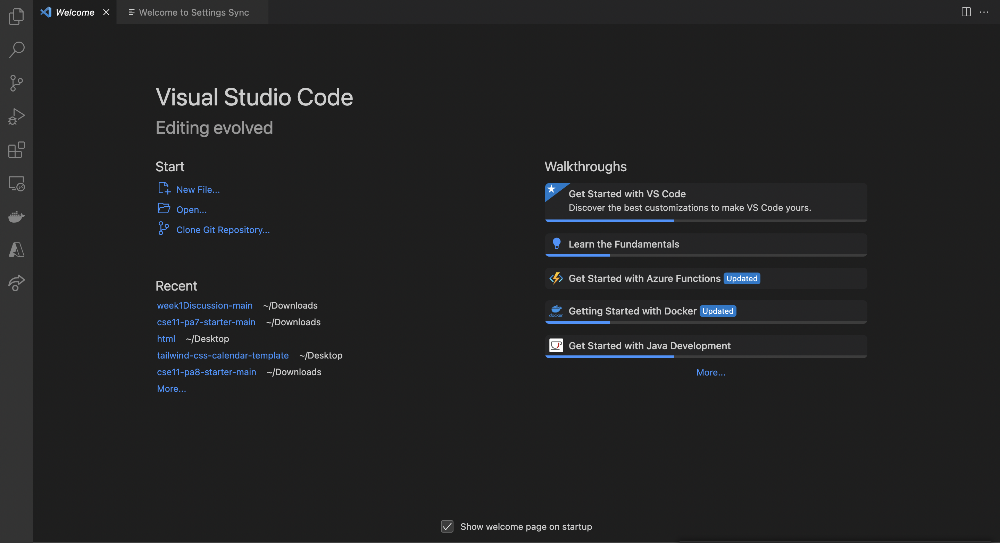

Hello, this is LAB REPORT 1. 
=========

Here are the steps to access your course-specific account on ieng6. The process is pretty simple but please make sure to follow the directions well. 

## Step 1: Download and Open VS Code. 
This step, in particular, was one that I didn't have to do since I already had VSCode downloaded onto my Mac. If this isn't the case for you please download it and open up VSCode. This is how it is supposed to look after everything has been downloaded properly. 

##Step 2: Open Terminal
Since I have a Mac, bash had already been downloaded. Therefore, the next step I took was to click on terminal located here 

and then selected New Terminal. 

##Step 3: Logging In
Type in ssh cs15lsp23zz@ieng6.ucsd.edu where zz are two letter that you must fill in from your own personal username. 

Next you will get a prompt like 
Are you sure you want to continue connecting (yes/no/[fingerprint])? 

I personally typed "yes" for extra security but this step is up to the user. 

Next, I typed in my password for my password. Note that when you type in your password it won't actually be seen but it will be written there. Click enter when you are done typing it in. 

This is how it should look like when you are done logging in. 

##Step 4: Trying Some Commands
Some interesting commands to try are cd and ls. Both of them are commands that are important when using the terminal. ls lets the user check what files are in a certain folder and cd is how to get into another folder. I used pwd to show how the user is changing the path. Here is how it looked like for me when I entered folder perl5. 

Some extra commands are 

cd ~
cd
ls -lat
ls -a

